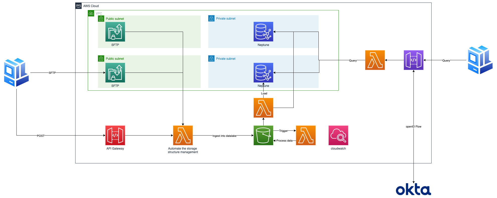

# PoC Architecture for Dun & Bradstreet Data platform

## Architecture

The major purpose of this PoC is to prove that the sample data from D&B's daily workloads can be loaded into Neptune for data analysis.

In addition, this whole process can be automated with simply lambda function. Meanwhile, AWS API gateway offers a way to integrate with OKTA to authorize client to make corresponding API requests in order to query from Neptune.

## Architecture explanation

The way to upload data is through SFTP, which is offered by transfer family. I have configured a workflow for this transfer family so that the data uploaded by this transfer family will be automatically stored on AWS in the form of rawdata/year=XX/month=XX/day=XX/XX, for which it makes postprocessing easier. Once the raw data gets successfully uploaded, a lambda function will be triggered automatically to transform the data into the corresponding format that can be loaded into Neptune. Lambda function should not be used to do such kind of data processing job in the prod environment as it lacks of flexibility in processing data. Glue should be used instead, or even EMR. Once the data is in the correct format, another lambda will be responsible to import those data into Neptune.

## Useful commands

 * `npm run build`   compile typescript to js
 * `npm run watch`   watch for changes and compile
 * `npm run test`    perform the jest unit tests
 * `cdk deploy`      deploy this stack to your default AWS account/region
 * `cdk diff`        compare deployed stack with current state
 * `cdk synth`       emits the synthesized CloudFormation template
